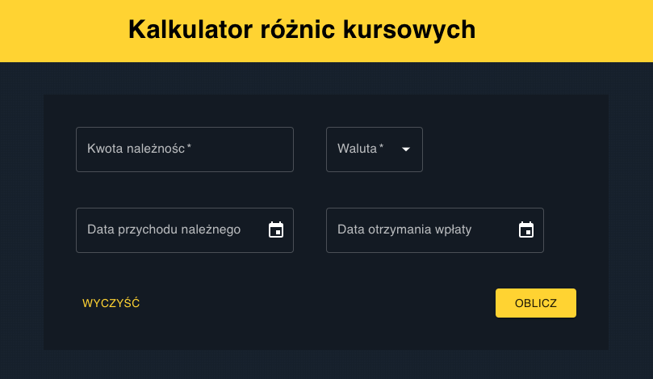

# Kalkulator różnic kursowych

[](https://github.com/balmor/exchange-rate/actions/workflows/ci.yml)

Aplikacja oblicza różnice kursowe na podstawie podanej waluty względem złotówki (PLN)

## Jak zacząć

Instalacja pakietów:

```
yarn install
```

Uruchomienie lokalnie w trybie development:

```
yarn start
```

Tworzenie aplikacji:

```
yarn build
```

## Link

[Exchange Rate](https://balmor.github.io/exchange-rate/)

## Podgląd

[](/public/preview.png)

## Do zrobienia

- [x] dodanie walidacji formularza
- [x] dodanie przycisku do wyczyszczenia formularza
- [x] pobranie kursów NBP zależnie od daty
- [x] możliwość pobrania wyniku jako dokument pdf
- [x] aktualizacja react-query v4 (https://tanstack.com/query/v4)
- [x] usuniecie useEffect oraz przeniesienie formatted data
- [x] dodanie responsywnego trybu dla tabletów i smartfonów
- [ ] sprawdzić https://pspdfkit.com/blog/2022/how-to-convert-html-to-pdf-using-react/
